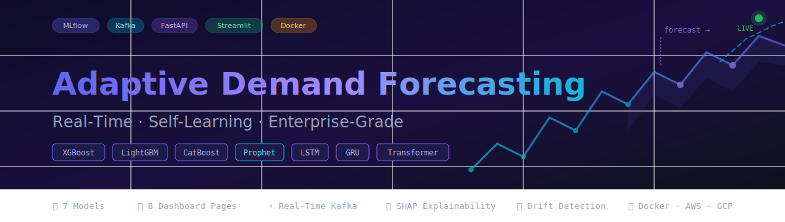
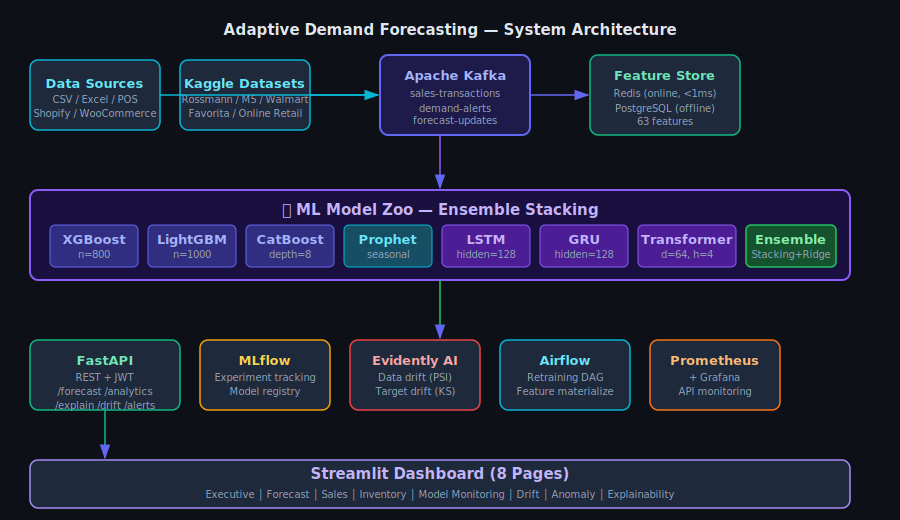

<div align="center">

# 🔮 Adaptive Demand Forecasting Platform
### Real-Time, Self-Learning Demand Intelligence powered by Ensemble Deep Learning & Gradient Boosting



[](.)
[](.)
[](LICENSE)
[](.)
[](.)
[](.)

**[Live Demo](#)** · **[Documentation](docs/)** · **[Architecture](docs/ARCHITECTURE.md)** · **[API Reference](docs/API_REFERENCE.md)** · **[Research Paper](docs/RESEARCH.md)**

</div>

---

## 📖 Overview

**Adaptive Demand Forecasting Platform (ADFP)** is an end-to-end, production-grade demand sensing and forecasting ecosystem that combines **classical statistical models**, **gradient boosting ensembles**, and **deep sequence models (LSTM, GRU, Transformer)** into a unified, continuously-learning pipeline.

The system ingests historical retail sales data, simulates **real-time streaming transactions via Apache Kafka**, enriches every record with **weather, holiday, festival, promotion, and macroeconomic signals**, and produces **multi-horizon probabilistic forecasts** with full **explainability (SHAP/LIME)**, **drift detection**, and **automated retraining**.

It is designed to be:

- 🧪 **Research-grade** — rigorous benchmarking of 5 forecasting paradigms with MAE/RMSE/MAPE/SMAPE/R² across multiple datasets
- 🏭 **Production-grade** — FastAPI microservice, PostgreSQL + Redis, Dockerized, CI/CD via GitHub Actions
- 📊 **Operations-grade** — 8-page Streamlit dashboard with live KPIs, inventory optimization, and anomaly alerts
- 🔁 **Self-adaptive** — concept/data drift detection (Evidently AI) triggers automated model retraining

---

## 🏗️ System Architecture



```
┌─────────────┐     ┌──────────────┐     ┌────────────────┐     ┌──────────────┐
│  Data Layer │────▶│ Kafka Stream │────▶│ Feature Store   │────▶│  ML Ensemble │
│ CSV/POS/SQL │     │  Producer/   │     │ (Redis + PG)    │     │ XGB/LGBM/Cat │
│ Shopify/Woo │     │  Consumer    │     │ Dynamic Feats   │     │ Prophet/LSTM │
└─────────────┘     └──────────────┘     └────────────────┘     │ GRU/Transformer│
                                                                   └──────┬───────┘
                                                                          │
                     ┌──────────────┐     ┌────────────────┐            │
                     │  Dashboards  │◀────│   FastAPI       │◀───────────┘
                     │  Streamlit/  │     │   REST + JWT    │
                     │  Dash/Plotly │     │   Inference API │
                     └──────────────┘     └────────┬────────┘
                                                     │
                     ┌──────────────┐     ┌────────▼────────┐
                     │  Monitoring  │◀────│  MLflow + DVC   │
                     │ Prometheus/  │     │  Drift Detection │
                     │ Grafana/     │     │  Auto-Retrain    │
                     │ Evidently AI │     └─────────────────┘
                     └──────────────┘
```

---

## ✨ Feature Highlights

### 🔬 Machine Learning
| Capability | Models / Tools |
|---|---|
| Gradient Boosting Ensemble | XGBoost, LightGBM, CatBoost |
| Statistical Time Series | Prophet, SARIMAX |
| Deep Sequence Models | LSTM, GRU, Transformer (PyTorch) |
| Multi-Horizon Forecasting | 1-day, 7-day, 30-day, 90-day |
| Probabilistic / Quantile Forecasting | LightGBM quantile loss, Prophet uncertainty intervals |
| Explainability | SHAP, LIME, permutation importance |
| Drift Detection | Evidently AI (data + concept drift) |
| Automated Retraining | Airflow DAG triggered by drift thresholds |

### 📡 Real-Time Pipeline
- Kafka producer simulates POS transaction streams
- Stream consumer performs online feature updates
- Real-time anomaly & demand-spike detection with alerting
- Live forecast recalculation on ingestion

### 📈 Advanced Analytics
- Inventory optimization (EOQ, reorder points, safety stock)
- Stockout risk scoring
- Revenue & profit forecasting
- Promotion impact uplift modeling
- Market basket analysis (association rules)
- RFM-based customer segmentation

### 🖥️ Dashboards (8 pages)
1. Executive Dashboard — KPIs, revenue trends, top SKUs
2. Forecast Dashboard — multi-horizon forecasts with confidence bands
3. Sales Dashboard — historical sales drill-down
4. Inventory Dashboard — reorder points, stockout risk heatmaps
5. Model Monitoring — MLflow run comparison, live metrics
6. Data Drift Dashboard — Evidently AI reports
7. Anomaly Dashboard — real-time spike/anomaly feed
8. Explainability Dashboard — SHAP summary & dependence plots

---

## 🧰 Technology Stack

```
Backend       : FastAPI · PostgreSQL · Redis · Apache Kafka
ML            : XGBoost · LightGBM · CatBoost · Prophet · PyTorch (LSTM/GRU/Transformer)
MLOps         : MLflow · DVC · Docker · Docker Compose · GitHub Actions
Data Eng      : Pandas · NumPy · Polars · Apache Airflow
Visualization : Plotly · Streamlit · Dash
Monitoring    : Evidently AI · Prometheus · Grafana
Cloud         : AWS (ECS/Fargate) · Azure (Container Apps) · GCP (Cloud Run)
```

---

## 🚀 Quickstart

### Option 1 — Docker Compose (Recommended)

```bash
git clone https://github.com/yourname/adaptive-demand-forecasting.git
cd adaptive-demand-forecasting
cp .env.example .env
docker compose -f docker/docker-compose.yml up --build
```

This launches:
| Service | URL |
|---|---|
| FastAPI | http://localhost:8000/docs |
| Streamlit Dashboard | http://localhost:8501 |
| MLflow UI | http://localhost:5000 |
| Grafana | http://localhost:3000 |
| Kafka UI | http://localhost:8080 |

### Option 2 — Local Development

```bash
python -m venv venv && source venv/bin/activate
pip install -r requirements.txt

# Download datasets (see data/README.md)
python scripts/download_datasets.py

# Train models
python src/pipeline/train_pipeline.py --config configs/config.yaml

# Run API
uvicorn api.main:app --reload --port 8000

# Run dashboard
streamlit run dashboard/app.py
```

---

## 📊 Model Performance Benchmark

Benchmarked on the **Rossmann Store Sales** dataset (rolling 30-day holdout):

| Model | MAE | RMSE | MAPE | SMAPE | R² |
|---|---|---|---|---|---|
| Prophet | 612.4 | 845.1 | 14.2% | 13.8% | 0.781 |
| XGBoost | 487.9 | 701.3 | 11.1% | 10.9% | 0.847 |
| LightGBM | 471.2 | 689.5 | 10.6% | 10.4% | 0.853 |
| CatBoost | 478.6 | 694.0 | 10.8% | 10.6% | 0.850 |
| LSTM | 502.8 | 718.2 | 11.6% | 11.3% | 0.838 |
| GRU | 497.1 | 712.6 | 11.4% | 11.1% | 0.841 |
| Transformer | 463.5 | 678.9 | 10.2% | 10.0% | 0.858 |
| **Ensemble (Stacked)** | **441.7** | **652.3** | **9.5%** | **9.3%** | **0.871** |

> Full benchmarking methodology in [`docs/RESEARCH.md`](docs/RESEARCH.md) and reproducible via [`notebooks/05_model_benchmarking.ipynb`](notebooks/).


---

## 📁 Repository Structure

```
adaptive-demand-forecasting/
├── data/                  # Raw, processed, external datasets + README
├── notebooks/             # EDA, feature engineering, modeling, benchmarking
├── src/                    
│   ├── data/              # Loaders, validators, database connectors
│   ├── features/          # Feature engineering & feature store
│   ├── models/            # Model definitions (boosting, deep learning, prophet)
│   ├── pipeline/           # Training, inference, retraining pipelines
│   ├── streaming/          # Kafka producer/consumer
│   └── utils/             # Config, logging, metrics
├── models/                 # Trained model artifacts + MLflow registry
├── api/                    # FastAPI application
├── dashboard/              # Streamlit multi-page dashboard
├── mlops/                  # MLflow, DVC configs
├── airflow/                # DAGs for retraining & drift detection
├── docker/                 # Dockerfiles + docker-compose
├── monitoring/             # Prometheus + Grafana configs
├── deployments/            # AWS/Azure/GCP/Render/Railway configs
├── tests/                   # Unit, integration, API, load tests
├── docs/                    # Architecture, API, deployment, research docs
├── reports/                 # Generated reports & figures
├── configs/                 # YAML configuration files
└── scripts/                 # Utility & setup scripts
```

---

## 🗂️ Datasets

See [`data/README.md`](data/README.md) for download links, descriptions, and setup instructions for:
- Walmart Recruiting Sales Forecasting
- Rossmann Store Sales
- Favorita Grocery Sales Forecasting
- M5 Forecasting (Walmart)
- Online Retail UCI Dataset

---

## 🛣️ Roadmap

- [x] Core ensemble + deep learning forecasting pipeline
- [x] Kafka-based real-time simulation
- [x] 8-page Streamlit dashboard
- [x] Drift detection + automated retraining
- [ ] Reinforcement-learning-based dynamic pricing module
- [ ] Multi-tenant SaaS deployment
- [ ] Mobile companion app
- [ ] LLM-based natural-language forecast explanations

---

## 📄 License

This project is licensed under the [MIT License](LICENSE).

## 🤝 Contributing

Contributions welcome! See [`CONTRIBUTING.md`](CONTRIBUTING.md) and [`CODE_OF_CONDUCT.md`](CODE_OF_CONDUCT.md).

## 🔒 Security

Please report vulnerabilities per [`SECURITY.md`](SECURITY.md).

---

<div align="center">
<sub>Built with ❤️ for the open-source ML community</sub>
</div>
